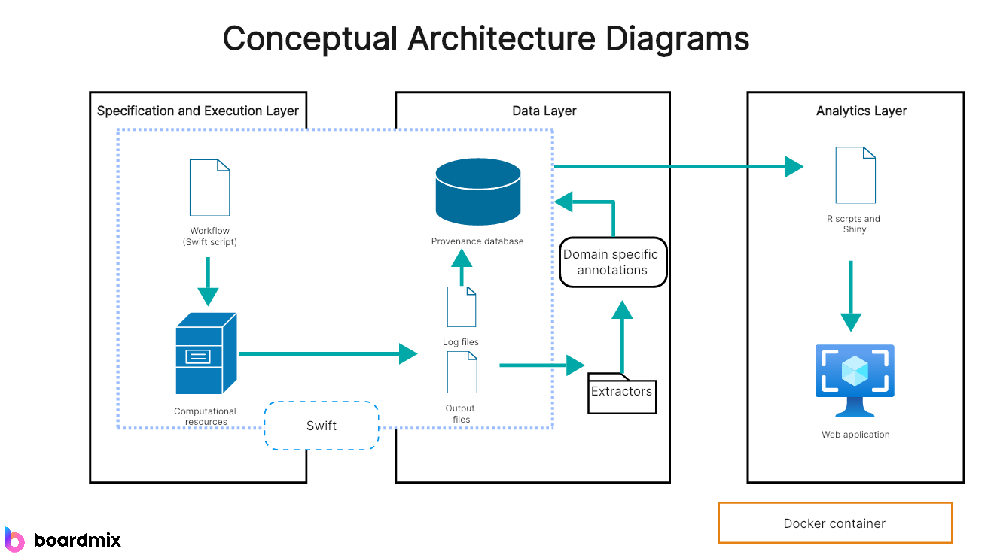

# Home - LL Demo IG v0.1.0

* [**Table of Contents**](toc.md)
* **Home**

## Home

| | |
| :--- | :--- |
| *Official URL*:http://example.ca/fhir/ImplementationGuide/fhir.ig.demo | *Version*:0.1.0 |
| Draft as of 2025-12-23 | *Computable Name*:LLDemoIG |

### Introduction

This page demonstrates various features available in FSH, SUSHI, and the IG Publisher for creating rich documentation.

#### Purpose

Learn how to:

* Structure content with sections
* Link to other pages and resources
* Embed images and diagrams
* Create tables
* Reference FHIR artifacts

#### Getting Started

For more details, see the [FHIR Artifacts](profiles.md) page or jump directly to [Profiles](profiles.md#profiles).

### Linking Examples

#### Links to Other Pages

You can link to other pages in your IG:

* [Home page](index.md)
* [Application A Integration Guide](app1.md)
* [Application B Integration Guide](app2.md)
* [Terminology page](terminology.md)
* [Summary](artifacts.md)

#### Links to Specific Sections

Use anchors to link to specific sections:

* [Jump to Section 3 below](#embedded-images)
* [Go to the PlantUML section](#plantuml-diagrams)

#### Links to FHIR Resources

Link to specific StructureDefinitions and other FHIR resources:

**Linking to your own profiles:**

* [Core Patient Profile](StructureDefinition-CorePatient.md)
* [Core Observation Profile](StructureDefinition-CoreObservation.md)

**Linking to ValueSets and CodeSystems:**

* [Patient Identifier Type ValueSet](ValueSet-PatientIdVS.md)
* [LL Identifier Type CodeSystem](CodeSystem-LLIdTypeCS.md)

#### External Links

Link to external resources:

* [FHIR R5 Specification](http://hl7.org/fhir/R5/)
* [US Core](http://hl7.org/fhir/us/core/)
* [HL7 FHIR Registry](https://registry.fhir.org/)

### Embedded Images

#### Local Images

Images should be placed in `input/images/` directory.

 **Figure 1: System Architecture Diagram**

#### Images with Specific Sizing

You can control image size using HTML:

### Embedded Diagrams

#### Markdown Tables as Diagrams

Simple flow can be shown with tables:

| | | |
| :--- | :--- | :--- |
| 1 | Patient Registration | Patient ID Created |
| 2 | Order Placement | Order ID Generated |
| 3 | Lab Test | Results Available |
| 4 | Results Review | Signed Report |

#### PlantUML Diagrams

Place your PlantUML files in `input/images-source/` directory (e.g., `sequence-diagram.plantuml`):

**File: input/images-source/sequence-diagram.plantuml**

```
@startuml
actor Patient
participant "EMR System" as EMR
participant "FHIR Server" as FHIR
database "Data Store" as DB

Patient -> EMR: Request appointment
EMR -> FHIR: POST /Appointment
FHIR -> DB: Store appointment
DB --> FHIR: Confirmation
FHIR --> EMR: Appointment ID
EMR --> Patient: Confirmation
@enduml

```

The IG Publisher will automatically convert `.plantuml` files to PNG images. Reference them like this:


**Another example - Class Diagram:**

**File: input/images-source/class-diagram.plantuml**

```
@startuml
class Patient {
  +identifier
  +name
  +gender
  +birthDate
}

class Observation {
  +status
  +code
  +value
  +subject
}

class Condition {
  +clinicalStatus
  +code
  +subject
}

Patient "1" -- "*" Observation
Patient "1" -- "*" Condition
@enduml

```


### Code Blocks

#### FSH Example

```
Profile: MyPatient
Parent: Patient
Id: my-patient
Title: "My Patient Profile"
Description: "An example patient profile"
* identifier 1..* MS
* name 1..* MS
* gender 1..1 MS
* birthDate 0..1 MS

```

#### JSON Example

```
{
  "resourceType": "Patient",
  "id": "example",
  "identifier": [{
    "system": "http://example.org/fhir/sid/patients",
    "value": "12345"
  }],
  "name": [{
    "family": "Smith",
    "given": ["John"]
  }],
  "gender": "male",
  "birthDate": "1970-01-01"
}

```

#### XML Example

```
<Patient xmlns="http://hl7.org/fhir">
  <id value="example"/>
  <identifier>
    <system value="http://example.org/fhir/sid/patients"/>
    <value value="12345"/>
  </identifier>
  <name>
    <family value="Smith"/>
    <given value="John"/>
  </name>
  <gender value="male"/>
  <birthDate value="1970-01-01"/>
</Patient>

```

### Embedded FHIR Artifacts

#### Auto-Generated Lists

Include automatically generated lists of your profiles:

* [App1Observation](StructureDefinition-App1Observation.md)

* [App1Patient](StructureDefinition-App1Patient.md)

* [App2Observation](StructureDefinition-App2Observation.md)

* [App2Patient](StructureDefinition-App2Patient.md)

* [CoreObservation](StructureDefinition-CoreObservation.md)

* [CorePatient](StructureDefinition-CorePatient.md)

#### Auto-Generated Tables

Include tables of your artifacts:

[App1Observation](StructureDefinition-App1Observation.md)

Observation profile for Application 1

[App1Patient](StructureDefinition-App1Patient.md)

Patient profile for Application 1

[App2Observation](StructureDefinition-App2Observation.md)

Observation profile for Application 2

[App2Patient](StructureDefinition-App2Patient.md)

Patient profile for Application 2

[CoreObservation](StructureDefinition-CoreObservation.md)

An example profile of the core Observation resource.

[CorePatient](StructureDefinition-CorePatient.md)

An example profile of the core Patient resource.

### Advanced Formatting

#### Callout Boxes

Use blockquotes for important notes:

> **Note:**This is an important note that implementers should pay attention to.

> **Warning:**This feature may change in future versions.

#### Nested Lists

Complex hierarchies can be shown with nested lists:

1. Patient Data Requirements
* Demographics 
* Name (required)
* Gender (required)
* Birth Date (optional)
 
* Contact Information 
* Phone (optional)
* Email (optional)
 
* Identifiers 
* Medical Record Number (required)
* Social Security Number (optional)
 

1. Observation Requirements
* Status (required)
* Code (required)
* Value (required)
* Subject reference (required)

#### Definition Lists

### Cross-References

#### Reference to Other Sections

As discussed in [Section 2.3](#links-to-fhir-resources), you can link to specific profiles.

For image embedding details, see [Section 3](#embedded-images).

For PlantUML diagrams, refer to [Section 4.2](#plantuml-diagrams).

#### Reference with Page Context

When discussing conformance requirements:

* See [Profiles and Extensions](profiles.md) for structural requirements
* See [Terminology](terminology.md) for required value sets
* See [Artifact Summary](artifacts.md) for all implementation resources including examples

### Summary

This page demonstrated:

* ✅ Table of Contents generation
* ✅ Section structure and numbering
* ✅ Internal and external linking
* ✅ Resource references
* ✅ Image embedding
* ✅ PlantUML diagram integration
* ✅ Table creation
* ✅ Code blocks
* ✅ Auto-generated artifact lists

For more information, visit the [FHIR Documentation](http://hl7.org/fhir/) or [SUSHI Documentation](https://fshschool.org/).


## Resource Content

```json
{
  "resourceType" : "ImplementationGuide",
  "id" : "fhir.ig.demo",
  "url" : "http://example.ca/fhir/ImplementationGuide/fhir.ig.demo",
  "version" : "0.1.0",
  "name" : "LLDemoIG",
  "title" : "LL Demo IG",
  "status" : "draft",
  "date" : "2025-12-23T19:22:15+00:00",
  "publisher" : "Example Publisher",
  "contact" : [
    {
      "name" : "Example Publisher",
      "telecom" : [
        {
          "system" : "url",
          "value" : "http://example.org/example-publisher"
        }
      ]
    }
  ],
  "description" : "Demo Implementation Guide for getting started with FSH, SUSHI and IG Builder",
  "packageId" : "fhir.ig.demo",
  "license" : "CC0-1.0",
  "fhirVersion" : ["5.0.0"],
  "dependsOn" : [
    {
      "id" : "hl7tx",
      "extension" : [
        {
          "url" : "http://hl7.org/fhir/tools/StructureDefinition/implementationguide-dependency-comment",
          "valueMarkdown" : "Automatically added as a dependency - all IGs depend on HL7 Terminology"
        }
      ],
      "uri" : "http://terminology.hl7.org/ImplementationGuide/hl7.terminology",
      "packageId" : "hl7.terminology.r5",
      "version" : "7.0.1"
    },
    {
      "id" : "hl7ext",
      "extension" : [
        {
          "url" : "http://hl7.org/fhir/tools/StructureDefinition/implementationguide-dependency-comment",
          "valueMarkdown" : "Automatically added as a dependency - all IGs depend on the HL7 Extension Pack"
        }
      ],
      "uri" : "http://hl7.org/fhir/extensions/ImplementationGuide/hl7.fhir.uv.extensions",
      "packageId" : "hl7.fhir.uv.extensions.r5",
      "version" : "5.2.0"
    }
  ],
  "definition" : {
    "extension" : [
      {
        "extension" : [
          {
            "url" : "code",
            "valueCode" : "special-url"
          },
          {
            "url" : "value",
            "valueString" : "https://example.ca/fhir/CodeSystem/identifier-type"
          }
        ],
        "url" : "http://hl7.org/fhir/tools/StructureDefinition/ig-parameter"
      },
      {
        "extension" : [
          {
            "url" : "code",
            "valueCode" : "special-url"
          },
          {
            "url" : "value",
            "valueString" : "https://lg.com/fhir/CodeSystem/identifier-type"
          }
        ],
        "url" : "http://hl7.org/fhir/tools/StructureDefinition/ig-parameter"
      },
      {
        "extension" : [
          {
            "url" : "code",
            "valueCode" : "special-url"
          },
          {
            "url" : "value",
            "valueString" : "https://rxvx.ca/fhir/CodeSystem/identifier-type"
          }
        ],
        "url" : "http://hl7.org/fhir/tools/StructureDefinition/ig-parameter"
      },
      {
        "extension" : [
          {
            "url" : "code",
            "valueCode" : "special-url"
          },
          {
            "url" : "value",
            "valueString" : "https://example.ca/fhir/extensions/global/createDate"
          }
        ],
        "url" : "http://hl7.org/fhir/tools/StructureDefinition/ig-parameter"
      },
      {
        "extension" : [
          {
            "url" : "code",
            "valueCode" : "special-url"
          },
          {
            "url" : "value",
            "valueString" : "https://example.ca/fhir/SearchParameter/updatedate"
          }
        ],
        "url" : "http://hl7.org/fhir/tools/StructureDefinition/ig-parameter"
      },
      {
        "url" : "http://hl7.org/fhir/tools/StructureDefinition/ig-internal-dependency",
        "valueCode" : "hl7.fhir.uv.tools.r5#0.9.0"
      }
    ],
    "resource" : [
      {
        "extension" : [
          {
            "url" : "http://hl7.org/fhir/tools/StructureDefinition/resource-information",
            "valueString" : "ValueSet"
          }
        ],
        "reference" : {
          "reference" : "ValueSet/App1ObsCodeVS"
        },
        "name" : "App1ObsCodeVS",
        "description" : "ValueSet of RxCA Observation codes",
        "isExample" : false
      },
      {
        "extension" : [
          {
            "url" : "http://hl7.org/fhir/tools/StructureDefinition/resource-information",
            "valueString" : "StructureDefinition:resource"
          }
        ],
        "reference" : {
          "reference" : "StructureDefinition/App1Observation"
        },
        "name" : "App1Observation",
        "description" : "Observation profile for Application 1",
        "isExample" : false
      },
      {
        "extension" : [
          {
            "url" : "http://hl7.org/fhir/tools/StructureDefinition/resource-information",
            "valueString" : "Observation"
          }
        ],
        "reference" : {
          "reference" : "Observation/App1ObservationExample"
        },
        "name" : "App1ObservationExample",
        "description" : "An example of Application 1 Observation",
        "isExample" : true,
        "profile" : ["http://example.ca/fhir/StructureDefinition/App1Observation"]
      },
      {
        "extension" : [
          {
            "url" : "http://hl7.org/fhir/tools/StructureDefinition/resource-information",
            "valueString" : "StructureDefinition:resource"
          }
        ],
        "reference" : {
          "reference" : "StructureDefinition/App1Patient"
        },
        "name" : "App1Patient",
        "description" : "Patient profile for Application 1",
        "isExample" : false
      },
      {
        "extension" : [
          {
            "url" : "http://hl7.org/fhir/tools/StructureDefinition/resource-information",
            "valueString" : "Patient"
          }
        ],
        "reference" : {
          "reference" : "Patient/App1PatientExample"
        },
        "name" : "App1PatientExample",
        "description" : "An example of Application 1 Patient",
        "isExample" : true,
        "profile" : ["http://example.ca/fhir/StructureDefinition/App1Patient"]
      },
      {
        "extension" : [
          {
            "url" : "http://hl7.org/fhir/tools/StructureDefinition/resource-information",
            "valueString" : "ValueSet"
          }
        ],
        "reference" : {
          "reference" : "ValueSet/App2ObsCatVS"
        },
        "name" : "App2ObsCatVS",
        "description" : "ValueSet of SDM App Observation categories",
        "isExample" : false
      },
      {
        "extension" : [
          {
            "url" : "http://hl7.org/fhir/tools/StructureDefinition/resource-information",
            "valueString" : "ValueSet"
          }
        ],
        "reference" : {
          "reference" : "ValueSet/App2ObsCodeVS"
        },
        "name" : "App2ObsCodeVS",
        "description" : "ValueSet of SDM App Observation codes",
        "isExample" : false
      },
      {
        "extension" : [
          {
            "url" : "http://hl7.org/fhir/tools/StructureDefinition/resource-information",
            "valueString" : "StructureDefinition:resource"
          }
        ],
        "reference" : {
          "reference" : "StructureDefinition/App2Observation"
        },
        "name" : "App2Observation",
        "description" : "Observation profile for Application 2",
        "isExample" : false
      },
      {
        "extension" : [
          {
            "url" : "http://hl7.org/fhir/tools/StructureDefinition/resource-information",
            "valueString" : "Observation"
          }
        ],
        "reference" : {
          "reference" : "Observation/App2ObservationExample"
        },
        "name" : "App2ObservationExample",
        "description" : "An example of Application 2 Observation",
        "isExample" : true,
        "profile" : ["http://example.ca/fhir/StructureDefinition/App2Observation"]
      },
      {
        "extension" : [
          {
            "url" : "http://hl7.org/fhir/tools/StructureDefinition/resource-information",
            "valueString" : "StructureDefinition:resource"
          }
        ],
        "reference" : {
          "reference" : "StructureDefinition/App2Patient"
        },
        "name" : "App2Patient",
        "description" : "Patient profile for Application 2",
        "isExample" : false
      },
      {
        "extension" : [
          {
            "url" : "http://hl7.org/fhir/tools/StructureDefinition/resource-information",
            "valueString" : "Patient"
          }
        ],
        "reference" : {
          "reference" : "Patient/App2PatientExample"
        },
        "name" : "App2PatientExample",
        "description" : "An example of Application 2 Patient",
        "isExample" : true,
        "profile" : ["http://example.ca/fhir/StructureDefinition/App2Patient"]
      },
      {
        "extension" : [
          {
            "url" : "http://hl7.org/fhir/tools/StructureDefinition/resource-information",
            "valueString" : "StructureDefinition:resource:abstract"
          }
        ],
        "reference" : {
          "reference" : "StructureDefinition/CoreObservation"
        },
        "name" : "CoreObservation",
        "description" : "An example profile of the core Observation resource.",
        "isExample" : false
      },
      {
        "extension" : [
          {
            "url" : "http://hl7.org/fhir/tools/StructureDefinition/resource-information",
            "valueString" : "StructureDefinition:resource:abstract"
          }
        ],
        "reference" : {
          "reference" : "StructureDefinition/CorePatient"
        },
        "name" : "CorePatient",
        "description" : "An example profile of the core Patient resource.",
        "isExample" : false
      },
      {
        "extension" : [
          {
            "url" : "http://hl7.org/fhir/tools/StructureDefinition/resource-information",
            "valueString" : "StructureDefinition:extension"
          }
        ],
        "reference" : {
          "reference" : "StructureDefinition/CreateDate"
        },
        "name" : "CreateDate",
        "description" : "This extension captures the creation date of the artifact on the client system (i.e., the system where it was generated).",
        "isExample" : false
      },
      {
        "extension" : [
          {
            "url" : "http://hl7.org/fhir/tools/StructureDefinition/resource-information",
            "valueString" : "NamingSystem"
          }
        ],
        "reference" : {
          "reference" : "NamingSystem/HHIdNS"
        },
        "name" : "HHIdNS",
        "description" : "A local system for HH identifiers.",
        "isExample" : false
      },
      {
        "extension" : [
          {
            "url" : "http://hl7.org/fhir/tools/StructureDefinition/resource-information",
            "valueString" : "CodeSystem"
          }
        ],
        "reference" : {
          "reference" : "CodeSystem/LGIdTypeCS"
        },
        "name" : "LG Identifier Type code system",
        "description" : "Custom code system to define LG identifier types",
        "isExample" : false
      },
      {
        "extension" : [
          {
            "url" : "http://hl7.org/fhir/tools/StructureDefinition/resource-information",
            "valueString" : "CodeSystem"
          }
        ],
        "reference" : {
          "reference" : "CodeSystem/LLIdTypeCS"
        },
        "name" : "LL Identifier Type code system",
        "description" : "Custom code system to define LL identifier types",
        "isExample" : false
      },
      {
        "extension" : [
          {
            "url" : "http://hl7.org/fhir/tools/StructureDefinition/resource-information",
            "valueString" : "ValueSet"
          }
        ],
        "reference" : {
          "reference" : "ValueSet/ObservationIdVS"
        },
        "name" : "ObservationIdVS",
        "description" : "ValueSet of Observation identifier types",
        "isExample" : false
      },
      {
        "extension" : [
          {
            "url" : "http://hl7.org/fhir/tools/StructureDefinition/resource-information",
            "valueString" : "StructureDefinition:extension"
          }
        ],
        "reference" : {
          "reference" : "StructureDefinition/ObservationSource"
        },
        "name" : "ObservationSource",
        "description" : "This extension captures the originating context of the observation, representing the type of source from which the observation data was obtained, such as a laboratory, point-of-care device, patient self-report, healthcare professional, or external registry. It distinguishes the semantic source of the observation from existing FHIR attributes like performer (who asserted or reported the observation), method (the analytical technique used), or device (the instrument involved). The source type is expressed as a CodeableConcept, with values mapped from the source system to a standardized or custom code system.",
        "isExample" : false
      },
      {
        "extension" : [
          {
            "url" : "http://hl7.org/fhir/tools/StructureDefinition/resource-information",
            "valueString" : "ValueSet"
          }
        ],
        "reference" : {
          "reference" : "ValueSet/PatientIdVS"
        },
        "name" : "PatientIdVS",
        "description" : "ValueSet of Patient identifier types",
        "isExample" : false
      },
      {
        "extension" : [
          {
            "url" : "http://hl7.org/fhir/tools/StructureDefinition/resource-information",
            "valueString" : "CodeSystem"
          }
        ],
        "reference" : {
          "reference" : "CodeSystem/RxVXIdTypeCS"
        },
        "name" : "RxVX Identifier Type code system",
        "description" : "Custom code system to define RxVX identifier types",
        "isExample" : false
      },
      {
        "extension" : [
          {
            "url" : "http://hl7.org/fhir/tools/StructureDefinition/resource-information",
            "valueString" : "SearchParameter"
          }
        ],
        "reference" : {
          "reference" : "SearchParameter/UpdateDateSP"
        },
        "name" : "UpdateDateSP",
        "description" : "Enabling search parameter to search updateDate extension that is used to capture client-side update timestamp.",
        "isExample" : false
      }
    ],
    "page" : {
      "sourceUrl" : "toc.html",
      "name" : "toc.html",
      "title" : "Table of Contents",
      "generation" : "html",
      "page" : [
        {
          "sourceUrl" : "index.html",
          "name" : "index.html",
          "title" : "Home",
          "generation" : "markdown"
        },
        {
          "sourceUrl" : "app1.html",
          "name" : "app1.html",
          "title" : "Application A Implementation",
          "generation" : "markdown"
        },
        {
          "sourceUrl" : "app2.html",
          "name" : "app2.html",
          "title" : "Application B Implementation",
          "generation" : "markdown"
        },
        {
          "sourceUrl" : "profiles.html",
          "name" : "profiles.html",
          "title" : "Profiles and Extensions",
          "generation" : "markdown"
        },
        {
          "sourceUrl" : "terminology.html",
          "name" : "terminology.html",
          "title" : "CodeSystems and ValueSets",
          "generation" : "markdown"
        }
      ]
    },
    "parameter" : [
      {
        "code" : {
          "system" : "http://hl7.org/fhir/tools/CodeSystem/ig-parameters",
          "code" : "copyrightyear"
        },
        "value" : "2025+"
      },
      {
        "code" : {
          "system" : "http://hl7.org/fhir/tools/CodeSystem/ig-parameters",
          "code" : "releaselabel"
        },
        "value" : "ci-build"
      },
      {
        "code" : {
          "system" : "http://hl7.org/fhir/tools/CodeSystem/ig-parameters",
          "code" : "autoload-resources"
        },
        "value" : "true"
      },
      {
        "code" : {
          "system" : "http://hl7.org/fhir/guide-parameter-code",
          "code" : "path-resource"
        },
        "value" : "input/capabilities"
      },
      {
        "code" : {
          "system" : "http://hl7.org/fhir/guide-parameter-code",
          "code" : "path-resource"
        },
        "value" : "input/examples"
      },
      {
        "code" : {
          "system" : "http://hl7.org/fhir/guide-parameter-code",
          "code" : "path-resource"
        },
        "value" : "input/extensions"
      },
      {
        "code" : {
          "system" : "http://hl7.org/fhir/guide-parameter-code",
          "code" : "path-resource"
        },
        "value" : "input/models"
      },
      {
        "code" : {
          "system" : "http://hl7.org/fhir/guide-parameter-code",
          "code" : "path-resource"
        },
        "value" : "input/operations"
      },
      {
        "code" : {
          "system" : "http://hl7.org/fhir/guide-parameter-code",
          "code" : "path-resource"
        },
        "value" : "input/profiles"
      },
      {
        "code" : {
          "system" : "http://hl7.org/fhir/guide-parameter-code",
          "code" : "path-resource"
        },
        "value" : "input/resources"
      },
      {
        "code" : {
          "system" : "http://hl7.org/fhir/guide-parameter-code",
          "code" : "path-resource"
        },
        "value" : "input/vocabulary"
      },
      {
        "code" : {
          "system" : "http://hl7.org/fhir/guide-parameter-code",
          "code" : "path-resource"
        },
        "value" : "input/maps"
      },
      {
        "code" : {
          "system" : "http://hl7.org/fhir/guide-parameter-code",
          "code" : "path-resource"
        },
        "value" : "input/testing"
      },
      {
        "code" : {
          "system" : "http://hl7.org/fhir/guide-parameter-code",
          "code" : "path-resource"
        },
        "value" : "input/history"
      },
      {
        "code" : {
          "system" : "http://hl7.org/fhir/guide-parameter-code",
          "code" : "path-resource"
        },
        "value" : "fsh-generated/resources"
      },
      {
        "code" : {
          "system" : "http://hl7.org/fhir/guide-parameter-code",
          "code" : "path-pages"
        },
        "value" : "template/config"
      },
      {
        "code" : {
          "system" : "http://hl7.org/fhir/guide-parameter-code",
          "code" : "path-pages"
        },
        "value" : "input/images"
      },
      {
        "code" : {
          "system" : "http://hl7.org/fhir/tools/CodeSystem/ig-parameters",
          "code" : "path-liquid"
        },
        "value" : "template/liquid"
      },
      {
        "code" : {
          "system" : "http://hl7.org/fhir/tools/CodeSystem/ig-parameters",
          "code" : "path-liquid"
        },
        "value" : "input/liquid"
      },
      {
        "code" : {
          "system" : "http://hl7.org/fhir/tools/CodeSystem/ig-parameters",
          "code" : "path-qa"
        },
        "value" : "temp/qa"
      },
      {
        "code" : {
          "system" : "http://hl7.org/fhir/tools/CodeSystem/ig-parameters",
          "code" : "path-temp"
        },
        "value" : "temp/pages"
      },
      {
        "code" : {
          "system" : "http://hl7.org/fhir/tools/CodeSystem/ig-parameters",
          "code" : "path-output"
        },
        "value" : "output"
      },
      {
        "code" : {
          "system" : "http://hl7.org/fhir/guide-parameter-code",
          "code" : "path-tx-cache"
        },
        "value" : "input-cache/txcache"
      },
      {
        "code" : {
          "system" : "http://hl7.org/fhir/tools/CodeSystem/ig-parameters",
          "code" : "path-suppressed-warnings"
        },
        "value" : "input/ignoreWarnings.txt"
      },
      {
        "code" : {
          "system" : "http://hl7.org/fhir/tools/CodeSystem/ig-parameters",
          "code" : "path-history"
        },
        "value" : "http://example.ca/fhir/history.html"
      },
      {
        "code" : {
          "system" : "http://hl7.org/fhir/tools/CodeSystem/ig-parameters",
          "code" : "template-html"
        },
        "value" : "template-page.html"
      },
      {
        "code" : {
          "system" : "http://hl7.org/fhir/tools/CodeSystem/ig-parameters",
          "code" : "template-md"
        },
        "value" : "template-page-md.html"
      },
      {
        "code" : {
          "system" : "http://hl7.org/fhir/tools/CodeSystem/ig-parameters",
          "code" : "apply-contact"
        },
        "value" : "true"
      },
      {
        "code" : {
          "system" : "http://hl7.org/fhir/tools/CodeSystem/ig-parameters",
          "code" : "apply-context"
        },
        "value" : "true"
      },
      {
        "code" : {
          "system" : "http://hl7.org/fhir/tools/CodeSystem/ig-parameters",
          "code" : "apply-copyright"
        },
        "value" : "true"
      },
      {
        "code" : {
          "system" : "http://hl7.org/fhir/tools/CodeSystem/ig-parameters",
          "code" : "apply-jurisdiction"
        },
        "value" : "true"
      },
      {
        "code" : {
          "system" : "http://hl7.org/fhir/tools/CodeSystem/ig-parameters",
          "code" : "apply-license"
        },
        "value" : "true"
      },
      {
        "code" : {
          "system" : "http://hl7.org/fhir/tools/CodeSystem/ig-parameters",
          "code" : "apply-publisher"
        },
        "value" : "true"
      },
      {
        "code" : {
          "system" : "http://hl7.org/fhir/tools/CodeSystem/ig-parameters",
          "code" : "apply-version"
        },
        "value" : "true"
      },
      {
        "code" : {
          "system" : "http://hl7.org/fhir/tools/CodeSystem/ig-parameters",
          "code" : "apply-wg"
        },
        "value" : "true"
      },
      {
        "code" : {
          "system" : "http://hl7.org/fhir/tools/CodeSystem/ig-parameters",
          "code" : "active-tables"
        },
        "value" : "true"
      },
      {
        "code" : {
          "system" : "http://hl7.org/fhir/tools/CodeSystem/ig-parameters",
          "code" : "fmm-definition"
        },
        "value" : "http://hl7.org/fhir/versions.html#maturity"
      },
      {
        "code" : {
          "system" : "http://hl7.org/fhir/tools/CodeSystem/ig-parameters",
          "code" : "propagate-status"
        },
        "value" : "true"
      },
      {
        "code" : {
          "system" : "http://hl7.org/fhir/tools/CodeSystem/ig-parameters",
          "code" : "excludelogbinaryformat"
        },
        "value" : "true"
      },
      {
        "code" : {
          "system" : "http://hl7.org/fhir/tools/CodeSystem/ig-parameters",
          "code" : "tabbed-snapshots"
        },
        "value" : "true"
      },
      {
        "code" : {
          "system" : "http://hl7.org/fhir/tools/CodeSystem/ig-parameters",
          "code" : "special-url"
        },
        "value" : "https://example.ca/fhir/CodeSystem/identifier-type"
      },
      {
        "code" : {
          "system" : "http://hl7.org/fhir/tools/CodeSystem/ig-parameters",
          "code" : "special-url"
        },
        "value" : "https://lg.com/fhir/CodeSystem/identifier-type"
      },
      {
        "code" : {
          "system" : "http://hl7.org/fhir/tools/CodeSystem/ig-parameters",
          "code" : "special-url"
        },
        "value" : "https://rxvx.ca/fhir/CodeSystem/identifier-type"
      },
      {
        "code" : {
          "system" : "http://hl7.org/fhir/tools/CodeSystem/ig-parameters",
          "code" : "special-url"
        },
        "value" : "https://example.ca/fhir/extensions/global/createDate"
      },
      {
        "code" : {
          "system" : "http://hl7.org/fhir/tools/CodeSystem/ig-parameters",
          "code" : "special-url"
        },
        "value" : "https://example.ca/fhir/SearchParameter/updatedate"
      }
    ]
  }
}

```
